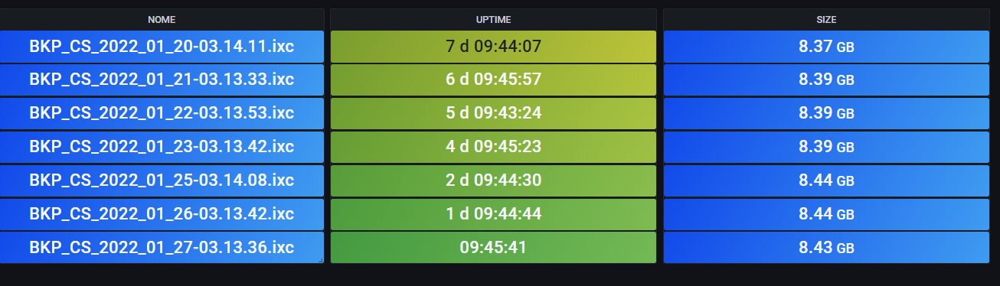
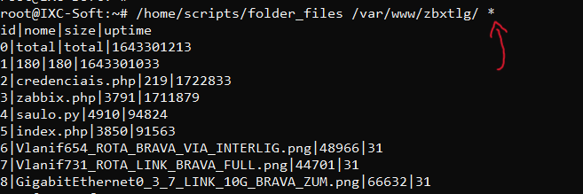
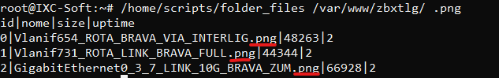
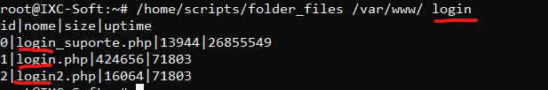
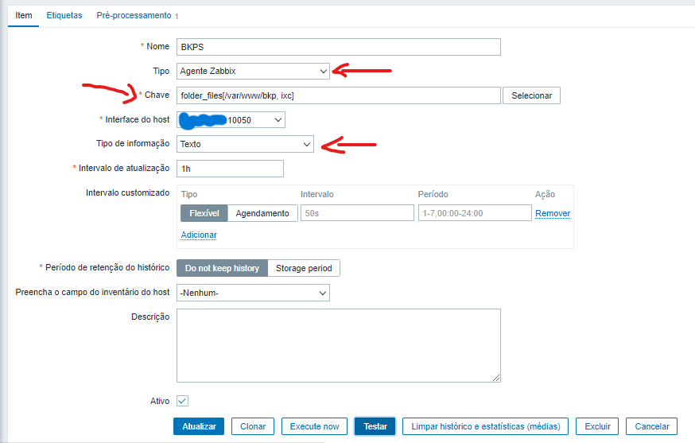
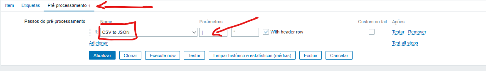
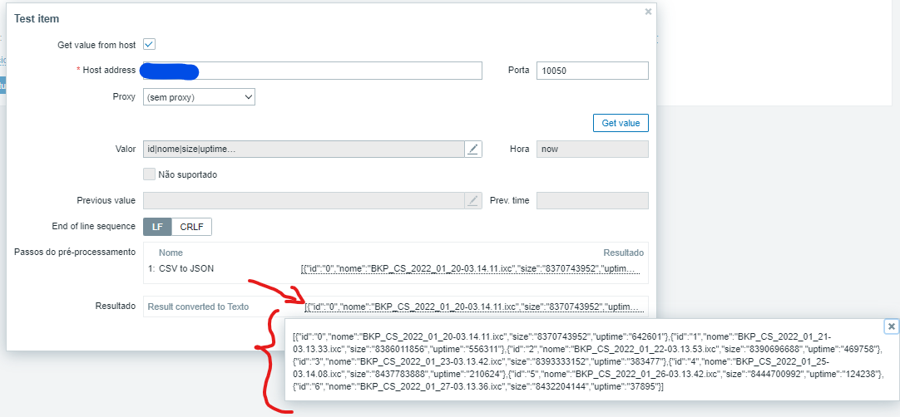

# Monitoramento de arquivos e diretórios com Zabbix

## Python e Shell Script

> Veja como obter os dados de uma pasta no seu Agente Zabbix e tranformar esse dados em um JSON ❤️ para 'monitorarmos' no Zabbix.

---

<div align="center">
   <!--  -->
   <!--  -->
   <!--  -->
   <!--  -->
   
   
   
   
</div>

---



## Como usar?

```sh
mkdir /home/scripts
cd /home/scripts
wget https://raw.githubusercontent.com/saulotarsobc/zabbix-monitoramento-diretorios-arquivos/main/folder_files
chmod +x folder_files
```

> /home/scripts/folder_files <'/home/folder_name'> <'regex'>

```sh
/home/scripts/folder_files /var/www/zbxtlg/ *
```



```sh
/home/scripts/folder_files /var/www/zbxtlg/ .png
```



```sh
/home/scripts/folder_files /var/www/ login
```



---

## UserParameter

```sh
nano /etc/zabbix/zabbix_agentd.conf -l
```

> UserParameter=folder_files[*],/home/scripts/folder_files $1 $2


```sh
zabbix_agentd -t folder_files[<folder>,<regex>]
```

> Ex: zabbix_agentd -t folder_files[/var/www/bkp,ixc]


---

## Script

```sh
#! /bin/bash
alert(){
    echo -e "./SCRIPT_NAME <DIRECTORY> <['FILE_EXTENSION'(mp3 | mp4 | ixc) | '*'(for all extensions)]>";
    echo -e "Ex: ./SCRIPT_NAME /home/musics mp3";
    echo -e "Ex: ./SCRIPT_NAME /home/downloads *";
    exit 0;
}

if [ "$1" = "" ]; then alert; fi;
if [ "$2" = "" ]; then alert; fi;

names=($(ls $1 -ltr --time-style='+%s' |grep ".$2" |sed -r -e 's/.*\s[0-9]+\s[0-9]+\s(.*)/\1/'));
sizes=($(ls $1 -ltr --time-style='+%s' |grep ".$2" |sed -r -e 's/.*\s([0-9]+)\s[0-9]+\s.*/\1/'));
dates=($(ls $1 -ltr --time-style='+%s' |grep ".$2" |sed -r -e 's/.*\s[0-9]+\s([0-9]+)\s.*/\1/'));

ID=0;
timestamp=$(date '+%s');

echo "id|nome|size|uptime";
for i in "${names[@]}";

do
    uptime=$(( timestamp - ${dates[$ID]} ));
    echo "$ID|${names[$ID]}|${sizes[$ID]}|$uptime";
    let ID=ID+1;
done;
```

---

## Zabbix

### Item

> Tipo: Agente Zabbix
> 
> Chave: folder_files[/var/www/bkp, ixc]
> 
> Tipo de informação: Texto



### Pre-processamento

> Nome: CSC to JSON
> 
> Parâmetros: | (pipe)



### Teste



> Temos um json 😍❤️

```json
[{"id":"0","nome":"BKP_CS_2022_01_20-03.14.11.ixc","size":"8370743952","uptime":"642601"},{"id":"1","nome":"BKP_CS_2022_01_21-03.13.33.ixc","size":"8386011856","uptime":"556311"},{"id":"2","nome":"BKP_CS_2022_01_22-03.13.53.ixc","size":"8390696688","uptime":"469758"},{"id":"3","nome":"BKP_CS_2022_01_23-03.13.42.ixc","size":"8393333152","uptime":"383477"},{"id":"4","nome":"BKP_CS_2022_01_25-03.14.08.ixc","size":"8437783888","uptime":"210624"},{"id":"5","nome":"BKP_CS_2022_01_26-03.13.42.ixc","size":"8444700992","uptime":"124238"},{"id":"6","nome":"BKP_CS_2022_01_27-03.13.36.ixc","size":"8432204144","uptime":"37895"}]
```

## Grafana


